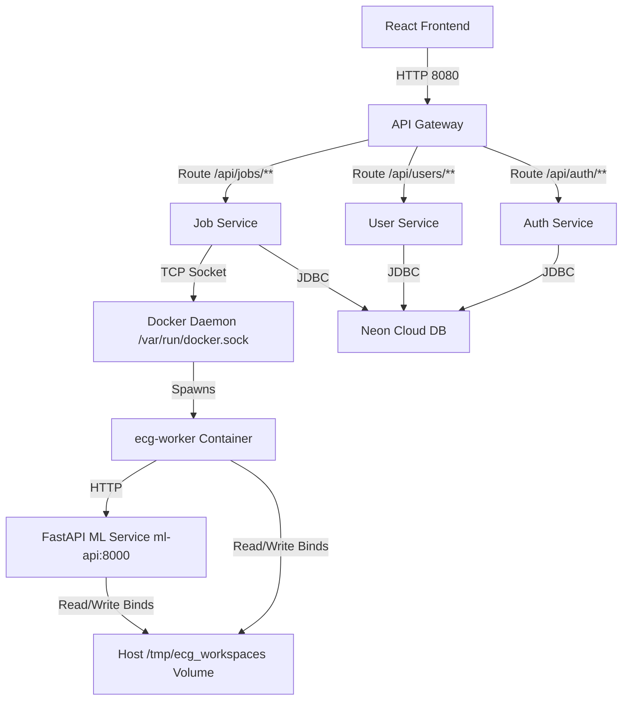
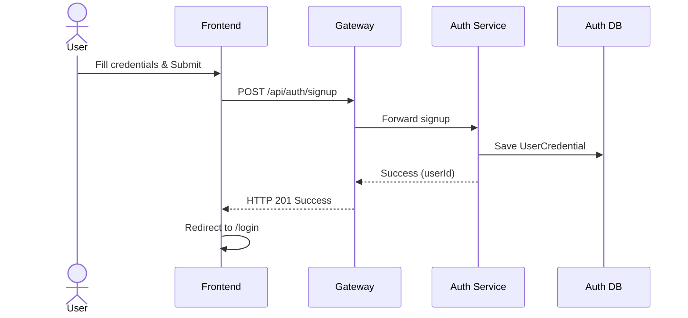
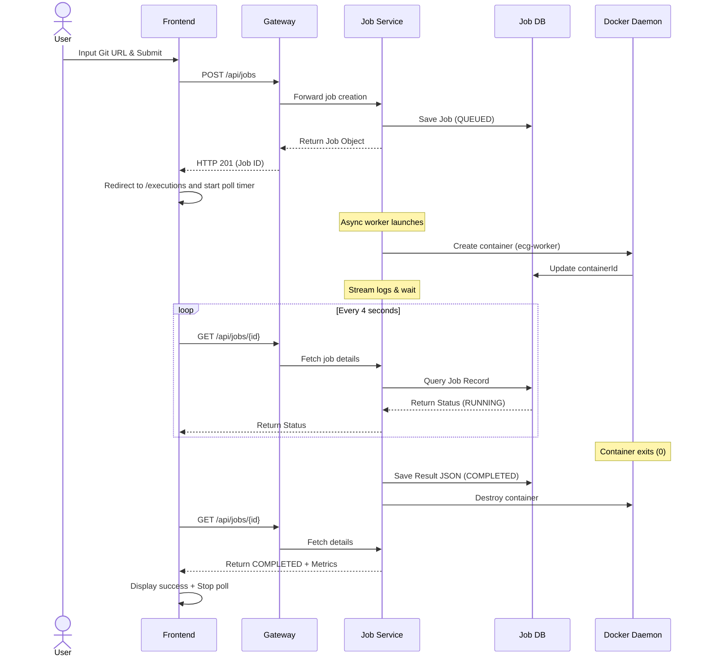
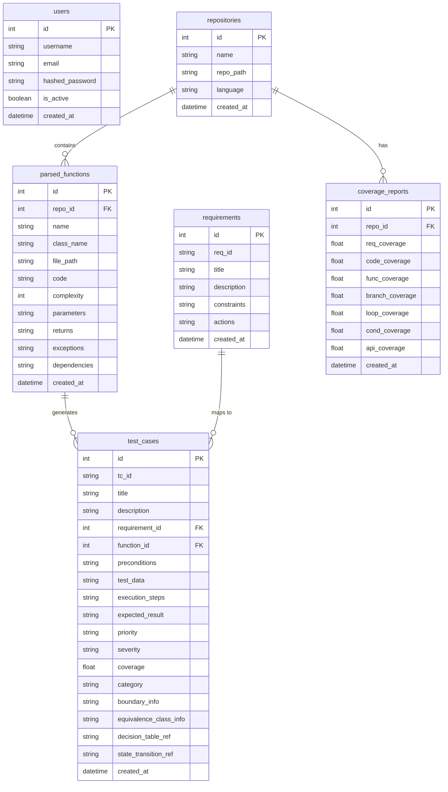
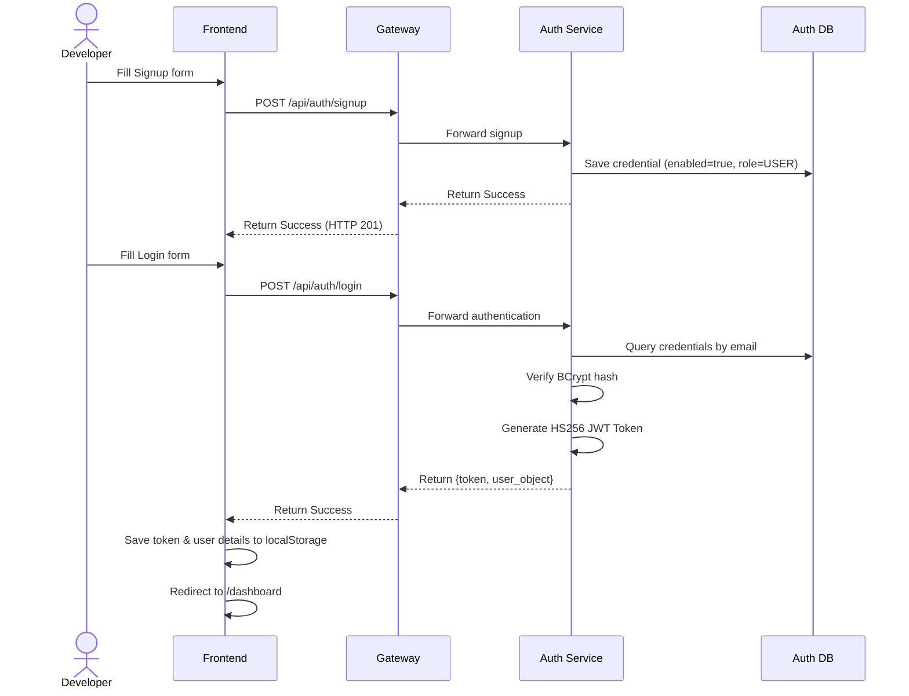
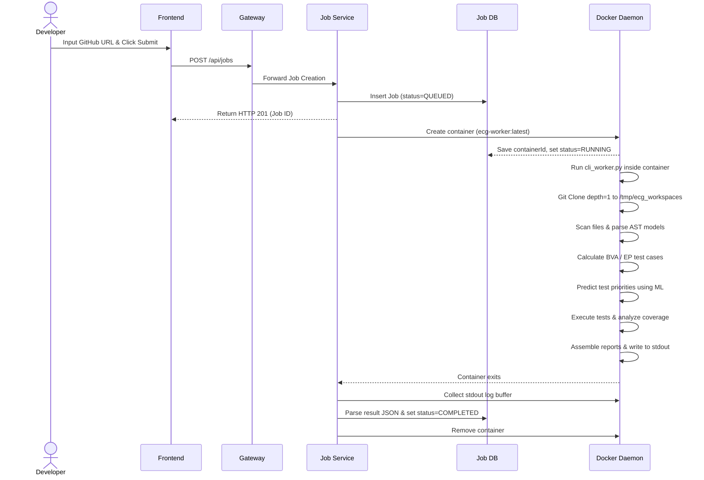

# AI-Powered Intelligent Test Case Generator — Technical Architecture

This document provides a comprehensive analysis of the system architecture, file responsibilities, data flows, and design choices of the **AI-Powered Intelligent Test Case Generator (EdgeCaseGenerator)**. It serves as an onboarding guide for new developers, explaining how every component works and communicates without needing to read the source code first.

---

## 1. Project Overview

### Purpose
The platform combines NLP, Static Code Analysis, DevOps containerization, and Machine Learning to automatically:
* **Scan repositories** using AST parsers to extract code elements.
* **Map functional requirements** to corresponding code blocks using sentence embedding similarity.
* **Generate intelligent test inputs** (applying Boundary Value Analysis, Equivalence Partitioning, Decision Tables, and State Transitions) and score code risk levels.
* **ML-Prioritize test cases** using a trained classifier.
* **Execute tests and track coverage** (lines, functions, branches, conditions).
* **Package generated test cases** into structured zip archives ready for developer download.

### High-Level Architecture
The project employs a hybrid microservices design. It can run in two modes:
1. **Microservices Mode (Production/Containerized)**: Coordinated by Java Spring Boot services. Jobs are sent via the Spring API Gateway to the `job-service`, which dynamically spawns short-lived Docker containers (`ecg-worker`) to analyze repositories and streams execution logs back to a Postgres database (hosted on Neon Cloud DB).
2. **Standalone FastAPI Mode (Development/Local)**: Managed by a single FastAPI application (`api.py` in the root). It handles databases locally using SQLite, performs requirements parsing, repository scanning, and test case generation in-process, bypassing the gateway and Spring Boot services.

```
┌──────────────────────────────────────────────────────────┐
│                     React Frontend                       │
└────────────────────────────┬─────────────────────────────┘
                             │
                             ▼
┌──────────────────────────────────────────────────────────┐
│              Spring Cloud API Gateway (8080)             │
└────────┬───────────────────┼───────────────────┬─────────┘
         │                   │                   │
         ▼                   ▼                   ▼
┌─────────────────┐ ┌─────────────────┐ ┌─────────────────┐
│  Auth Service   │ │  User Service   │ │   Job Service   │ ◄───► Eureka Registry (8761)
│     (8081)      │ │     (8082)      │ │     (8083)      │ ◄───► Config Server (8888)
└────────┬────────┘ └────────┬────────┘ └────────┬────────┘
         │                   │                   │
         │                   │                   ▼  (Spawns container)
         │                   │          ┌─────────────────┐
         │                   │          │   ecg-worker    │  (Stateless runner)
         │                   │          └────────┬────────┘
         │                   │                   │  (Calls API)
         ▼                   ▼                   ▼
┌──────────────────────────────────────────────────────────┐
│                    Neon Cloud Database                   │
│   (auth_db)            (user_db)            (job_db)     │
└──────────────────────────────────────────────────────────┘
```

### Major Components
* **Frontend**: Built with React, Vite, Tailwind CSS, Recharts, and Framer Motion.
* **API Gateway**: Spring Cloud Gateway that enforces CORS, rate limiting, and checks JWT tokens using custom filters.
* **Eureka & Config Servers**: Spring Cloud infrastructure components for service discovery and centralized config server distribution.
* **Auth & User Services**: Maintain credential tables (`user_credentials`) and profiles (`users`) respectively in Postgres.
* **Job Service**: Acts as the orchestrator for asynchronous worker execution. Communicates with Docker over `/var/run/docker.sock` to build and run container images.
* **ML API (`api.py`)**: A Python FastAPI server that serves embedding requests, prioritization predictions, and dynamic ZIP building.
* **CLI Worker (`cli_worker.py`)**: A Python CLI script packaged into the `ecg-worker` image that performs clones, parsing, and pipeline orchestration.

### Folder Structure
```
EdgeCaseGenerator/
├── .env                        # Root-level configuration parameters
├── Dockerfile                  # Base Python runner dockerfile
├── Dockerfile.worker           # Short-lived CLI analysis worker dockerfile
├── DockerfilePython            # FastAPI ML service runner dockerfile
├── api.py                      # Unified FastAPI Backend
├── bootstrap.py                # Sys path & model bootstrap utility
├── cli_worker.py               # Standalone worker script executed inside Docker
├── docker-compose.yml          # Container configuration for local deployment
├── ai_engine/                  # NLP, Vector DB, and Test Generation Core
│   ├── code_parser.py          # AST parser (Python AST / Tree-sitter dispatchers)
│   ├── coverage_engine.py      # Coverage analytics & composite metrics builder
│   ├── embedding_engine.py     # Sentence Transformers & CodeBERT embedding engine
│   ├── ml_prioritizer.py       # Random Forest test prioritizer
│   ├── requirement_parser.py   # spaCy NLP requirement constraint extractor
│   ├── similarity_engine.py    # Multi-dimensional vector index matching
│   └── vector_db.py            # Local FAISS-like similarity database indexer
├── backend/                    # Spring Boot Services & Python DB scripts
│   ├── api_gateway/            # Routing, rate limiter, & authentication gateway
│   ├── auth_service/           # Handles user registrations & login
│   ├── config_server/          # Shared service configuration server
│   ├── config_repo/            # Local configuration repository properties
│   ├── eureka_server/          # Service registration dashboard
│   ├── job-service/            # Docker containers lifecycle management
│   ├── user_service/           # Profile management
│   ├── database.py             # FastAPI SQLAlchemy session helper
│   └── models.py               # FastAPI SQLite database entities
├── frontend/                   # React Web Application
│   ├── src/
│   │   ├── App.jsx             # Client routers
│   │   ├── context/            # Auth and Sidebar state providers
│   │   ├── pages/              # View pages (Upload, Dashboard, Executions)
│   │   └── services/           # Axios client wrappers (api.js)
│   └── vite.config.js          # Resolves aliases & local proxies
└── orchestrator/               # Python pipeline executor
    ├── pipeline.py             # Stateless orchestrator pipeline
    └── pipeline_stages.py      # Parallel parsing & repository metadata analysis
```

---

## 2. Overall System Architecture

The complete system diagram outlining the microservice interactions is shown below:



### Infrastructure Components
* **Frontend**: React + Vite SPA. Communicates with Gateway on `http://localhost:8080`.
* **Backend Services**: Five core Spring Boot JVMs:
  1. `api-gateway` (Port 8080)
  2. `eureka-server` (Port 8761)
  3. `config-server` (Port 8888)
  4. `auth-service` (Port 8081)
  5. `user-service` (Port 8082)
  6. `job-service` (Port 8083)
* **Databases**: Hosted PostgreSQL on Neon Cloud. Separate databases are set up for each JVM service (`auth_db`, `user_db`, `job_db`, `execution_db`, `report_db`). A local SQLite instance is created if using FastAPI standalone.
* **Authentication**: Enforced via state-free HS256 JWT tokens. Custom gateway gateway filters authenticate route headers.
* **Job Execution & Workers**: Triggered as short-lived Docker runtimes. The container executes a Python CLI parser, queries CodeBERT embeddings from `ml-api`, and is automatically removed by the Java orchestration daemon on exit.
* **File Storage**: Shared workspace mounts (`/tmp/ecg_workspaces`).

---

## 3. Complete User Workflow

```
Signup
  ↓
Login
  ↓
Dashboard (Loads stats & user jobs)
  ↓
New Analysis (Upload Page -> Enter GitHub URL)
  ↓
Job Submission (job-service starts Docker container)
  ↓
cloning & AST scan (ecg-worker extracts code models)
  ↓
Test Generation (BVA & EP testing calculations)
  ↓
ML Prioritization (Random Forest prioritizer runs)
  ↓
Execution & Coverage (Runs pytest, checks lines, updates DB)
  ↓
Report Complete (Gateway records complete JSON)
  ↓
View Results (Charts and editor populated)
  ↓
Download ZIP (ZIP retrieved from ML API)
  ↓
Logout
```

### Stage details

#### 1. User Signup
* **User Action**: Enters name, email, and password on `/signup` page.
* **Frontend**: Sends POST `/api/auth/signup` to Gateway.
* **Backend**: Gateway forwards to `auth-service`.
* **Database**: `auth-service` inserts user details in PostgreSQL `user_credentials` table with default role `USER`.
* **Response**: Return confirmation message with HTTP 201.

#### 2. User Login
* **User Action**: Enters email and password on `/login` page.
* **Frontend**: Sends POST `/api/auth/login` to Gateway.
* **Backend**: `auth-service` verifies password hash using BCrypt and generates a JWT token.
* **Response**: Returns JWT token and user profile object. The token is saved in frontend's browser `localStorage` as `token`.

#### 3. Access Dashboard
* **User Action**: View dashboard page `/dashboard`.
* **Frontend**: Triggers two parallel API calls: GET `/api/requirements` and GET `/api/jobs/user/{email}`.
* **Backend**: Gateway routes jobs query to `job-service` and requirements to FastAPI/Stand-alone (mapped via `PROJECT-SERVICE`).
* **Database**: Queries Neon DB `jobs` table for user's jobs.
* **State changes**: Frontend parses `resultJson` from jobs, computes averages, and populates area charts and tables.

#### 4. New Repository Analysis
* **User Action**: Selects 'GitHub URL' tab in `/upload`, inputs a HTTPS GitHub URL (e.g. `https://github.com/user/repo`), and clicks 'Analyze Repository'.
* **Frontend**: Sends POST `/api/jobs` containing `{ repoUrl, userName, userEmail }`.
* **Backend**: Gateway routes to `job-service`.
* **Database**: Job service saves a new Job record with status `QUEUED`.
* **Background Tasks**:
  * A Spring Boot transaction synchronization listener triggers `launchWorkerAsync(jobId)` on commit.
  * In the background, `job-service` talks to `/var/run/docker.sock` to check image availability, creates the container with the command: `python cli_worker.py <jobId> <repoUrl>`, maps the shared volume `/tmp/ecg_workspaces`, and starts the container.
  * `job-service` updates status to `RUNNING` in the database.
* **State changes**: Frontend transitions from loading to `/executions` list and begins polling the job status.

#### 5. Container Execution (Inside `ecg-worker`)
* **Background Tasks**:
  * The container starts and executes `cli_worker.py`.
  * Clones the repository into `/tmp/ecg_workspaces/repo_<jobId>_/repo` with `--depth 1`.
  * Runs the stateless parser pipeline:
    * `scan`: Traverses repository, maps file paths, and identifies languages (Python, JS, TS, Java, C++).
    * `parse`: Invokes standard Python AST or Tree-sitter parsers to extract functions, classes, dependencies, conditions, loops, and exceptions.
    * `generate_tests`: Calls `TestingIntelligenceEngine` to calculate boundary value checks, equivalence class data, and decision combinations.
    * `ML prioritization`: Runs `TestPrioritizer` to predict priority categories.
    * `write_tests`: Writes output test files.
    * `exec_tests`: Performs local execution using test frameworks.
    * `coverage`: Measures covered and uncovered functions.
    * `risk`: Generates cyclomatic risk analysis.
    * `report`: Consolidates all logs, coverage files, and analysis parameters into a single unified JSON payload.
  * Prints output JSON to stdout enclosed inside `---RESULT_JSON_START---` and `---RESULT_JSON_END---`.
* **Response**: Container exits.

#### 6. Job completion
* **Background Tasks**:
  * `job-service` detects container termination.
  * Collects stdout logs, parses content between the markers, and stores it in `result_json` in PostgreSQL.
  * Destroys the container.
  * Updates Job status to `COMPLETED` or `FAILED` in the database.
* **Response**: Frontend poll detects status change. User can now click "View report".

#### 7. Download ZIP Archive
* **User Action**: Clicks "Download Tests" button on the execution page.
* **Frontend**: Sends GET `/api/jobs/{id}/download` requesting a dynamic test file.
* **Backend**: Gateway routes to `job-service` controller.
  * `job-service` loads the `resultJson` from the DB.
  * Feeds the `generated_tests` array to `ml-api` POST `/api/download` endpoint.
  * `ml-api` compiles the parameters, generates structured pytest test suites (e.g. `test_<file>.py` files), creates a markdown manifest, zips the folder, and returns the binary stream.
* **Response**: Browser triggers file download of `<jobId>_tests.zip`.

---

## 4. Complete API Lifecycle

### Master Endpoint Catalog

| API Endpoint | HTTP Method | Purpose | Called From (Frontend File) | Backend Controller / Service | Database Tables | Auth Required | Request Body | Response |
| :--- | :--- | :--- | :--- | :--- | :--- | :--- | :--- | :--- |
| `/api/auth/signup` | POST | Register new user credential | [SignupPage.jsx](file:///f:/EdgeCaseGenerator/frontend/src/pages/auth/SignupPage.jsx) | `AuthController.java` / `auth-service` | `user_credentials` | No | `{ email, password, name }` | `{ message, userId }` |
| `/api/auth/login` | POST | Authenticate user & grant JWT | [LoginPage.jsx](file:///f:/EdgeCaseGenerator/frontend/src/pages/auth/LoginPage.jsx) | `AuthController.java` / `auth-service` | `user_credentials` | No | `{ username, email, password }` | `{ token, token_type, user }` |
| `/api/auth/me` | GET | Retrieve current profile | [AuthContext.jsx](file:///f:/EdgeCaseGenerator/frontend/src/context/AuthContext.jsx) | `AuthController.java` / `auth-service` | `user_credentials` | Yes | None | `{ id, username, email, name }` |
| `/api/jobs` | POST | Submit repository for analysis | [UploadPage.jsx](file:///f:/EdgeCaseGenerator/frontend/src/pages/upload/UploadPage.jsx) | `JobController.java` / `job-service` | `jobs` | Yes | `{ repoUrl, userName, userEmail }` | `JobResponse` object (Queued status) |
| `/api/jobs` | GET | List all jobs | None | `JobController.java` / `job-service` | `jobs` | Yes | None | `List<JobResponse>` |
| `/api/jobs/{id}` | GET | Get job details & result metrics | [ExecutionDetailPage.jsx](file:///f:/EdgeCaseGenerator/frontend/src/pages/execution/ExecutionDetailPage.jsx) | `JobController.java` / `job-service` | `jobs` | Yes | None | `JobResponse` |
| `/api/jobs/user/{email}` | GET | Get jobs submitted by user | [DashboardPage.jsx](file:///f:/EdgeCaseGenerator/frontend/src/pages/dashboard/DashboardPage.jsx) | `JobController.java` / `job-service` | `jobs` | Yes | None | `List<JobResponse>` |
| `/api/jobs/{id}` | DELETE | Remove job records | [ExecutionPage.jsx](file:///f:/EdgeCaseGenerator/frontend/src/pages/execution/ExecutionPage.jsx) | `JobController.java` / `job-service` | `jobs` | Yes | None | Void (HTTP 204) |
| `/api/jobs/{id}/download` | GET | Download test suite ZIP | [ExecutionDetailPage.jsx](file:///f:/EdgeCaseGenerator/frontend/src/pages/execution/ExecutionDetailPage.jsx) | `JobController.java` / `job-service` | `jobs` | Yes | None | Binary ZIP stream |
| `/api/requirements` | POST | Create requirement constraints | [RequirementsPage.jsx](file:///f:/EdgeCaseGenerator/frontend/src/pages/requirements/RequirementsPage.jsx) | FastAPI Standalone (`api.py`) | `requirements` | Yes | `{ req_id, title, description }` | `{ message, id, extracted_constraints }` |
| `/api/requirements` | GET | List functional requirements | [DashboardPage.jsx](file:///f:/EdgeCaseGenerator/frontend/src/pages/dashboard/DashboardPage.jsx) | FastAPI Standalone (`api.py`) | `requirements` | Yes | None | `List<Requirement>` |
| `/api/requirements/{id}` | DELETE | Delete requirement constraints | [RequirementsPage.jsx](file:///f:/EdgeCaseGenerator/frontend/src/pages/requirements/RequirementsPage.jsx) | FastAPI Standalone (`api.py`) | `requirements` | Yes | None | `{ message }` |
| `/api/requirements/map` | POST | Bind requirement to source functions | [RequirementMappingPage.jsx](file:///f:/EdgeCaseGenerator/frontend/src/pages/requirements/RequirementMappingPage.jsx) | FastAPI Standalone (`api.py`) | `parsed_functions`, `requirements` | Yes | `{ repo_id, threshold }` | `{ message, mappings }` |
| `/api/projects/{repo_id}/testcases/generate` | POST | Generate test cases via AST | [ProjectOverviewPage.jsx](file:///f:/EdgeCaseGenerator/frontend/src/pages/projects/ProjectOverviewPage.jsx) | FastAPI Standalone (`api.py`) | `parsed_functions`, `test_cases`, `coverage_reports` | Yes | None | `{ message, test_cases_created }` |
| `/api/projects/{repo_id}/testcases` | GET | Get generated tests | [TestCasesPage.jsx](file:///f:/EdgeCaseGenerator/frontend/src/pages/testcases/TestCasesPage.jsx) | FastAPI Standalone (`api.py`) | `test_cases` | Yes | None | `List<TestCase>` |
| `/api/projects/{repo_id}/coverage` | GET | Get project coverage stats | [CoverageReportPage.jsx](file:///f:/EdgeCaseGenerator/frontend/src/pages/reports/CoverageReportPage.jsx) | FastAPI Standalone (`api.py`) | `coverage_reports` | Yes | None | Coverage metrics JSON |

### Automated API Sequences

#### Signup Sequence


#### Job Execution & Polling Sequence


---

## 5. Frontend Architecture

The frontend is a React single-page application built on top of Vite and Tailwind CSS.

### Routing Table (`App.jsx`)
* `/` -> [LandingPage.jsx](file:///f:/EdgeCaseGenerator/frontend/src/pages/landing/LandingPage.jsx) (Public)
* `/login` -> [LoginPage.jsx](file:///f:/EdgeCaseGenerator/frontend/src/pages/auth/LoginPage.jsx) (Public, wraps AuthLayout)
* `/signup` -> [SignupPage.jsx](file:///f:/EdgeCaseGenerator/frontend/src/pages/auth/SignupPage.jsx) (Public, wraps AuthLayout)
* `/dashboard` -> [DashboardPage.jsx](file:///f:/EdgeCaseGenerator/frontend/src/pages/dashboard/DashboardPage.jsx) (Protected)
* `/upload` -> [UploadPage.jsx](file:///f:/EdgeCaseGenerator/frontend/src/pages/upload/UploadPage.jsx) (Protected)
* `/executions` -> [ExecutionPage.jsx](file:///f:/EdgeCaseGenerator/frontend/src/pages/execution/ExecutionPage.jsx) (Protected)
* `/executions/:id` -> [ExecutionDetailPage.jsx](file:///f:/EdgeCaseGenerator/frontend/src/pages/execution/ExecutionDetailPage.jsx) (Protected)
* `/requirements` -> [RequirementsPage.jsx](file:///f:/EdgeCaseGenerator/frontend/src/pages/requirements/RequirementsPage.jsx) (Protected)
* `/requirement-mapping` -> [RequirementMappingPage.jsx](file:///f:/EdgeCaseGenerator/frontend/src/pages/requirements/RequirementMappingPage.jsx) (Protected)
* `/reports` -> [ReportsDashboardPage.jsx](file:///f:/EdgeCaseGenerator/frontend/src/pages/reports/ReportsDashboardPage.jsx) (Protected)
* `/testcases` -> [TestCasesPage.jsx](file:///f:/EdgeCaseGenerator/frontend/src/pages/testcases/TestCasesPage.jsx) (Protected)

### Context Providers & Hooks
* `AuthProvider` ([AuthContext.jsx](file:///f:/EdgeCaseGenerator/frontend/src/context/AuthContext.jsx)): Stores the active user profile (`user` state), authentication state (`isAuthenticated` boolean), and exposes `login`, `signup`, and `logout` operations. Handles localStorage synchronization for token caching.
* `SidebarProvider` ([SidebarContext.jsx](file:///f:/EdgeCaseGenerator/frontend/src/context/SidebarContext.jsx)): Manages drawer collapsed/expanded states for navigation layouts.
* `useJobPolling` ([useJobPolling.js](file:///f:/EdgeCaseGenerator/frontend/src/hooks/useJobPolling.js)): Standard hook that schedules recursive polling via `setInterval` to monitor job runs.

### Storage & Caching
* **Local Storage**:
  * `token`: Stores the active Bearer JWT token.
  * `user`: Stores the JSON-stringified user details (email, username, name).
* **Session Storage**:
  * `lastJobId`: Set in `UploadPage.jsx` when submitting a new analysis URL. Helps highlight the newly added job in the executions grid.
* **Component-Level State (`useState`)**: Used for managing interactive filters, input fields, log viewers, and loading indicators.

> [!WARNING]  
> **Aesthetic Discrepancy Note**: The project `README.md` references **Redux Toolkit** for state management. However, there is no Redux configuration or store in the codebase. The frontend uses standard React Context (`AuthContext`) and local state hook bindings.

### Page Data Mappings

#### Dashboard Page
* **API Invocations**: GET `/api/requirements`, GET `/api/jobs/user/{email}`.
* **Displayed Data**: Total analyzed repositories count, aggregate generated tests count, average coverage percent, active risk count, log execution feeds.
* **Cached Data**: None. Fetched fresh on mount.
* **Editable Data**: None (read-only view).

#### Upload Page
* **API Invocations**: POST `/api/jobs`.
* **Displayed Data**: Code files dropzones, list of supported languages (Python, JS, TS, Java, C++), input URL fields.
* **Editable Data**: `repoUrl` (text field input), `branch` selection, `framework` options dropdown.

#### Execution Detail Page
* **API Invocations**: GET `/api/jobs/{id}` (polled every 3 seconds).
* **Displayed Data**: Real-time console logs, container execution status badge, completed steps timeline.
* **Editable Data**: None.

---

## 6. Backend Architecture

The backend consists of Spring Boot Java services and a FastAPI Python application.

```
Request Flow:
Client Request
  ↓
API Gateway Filter (Validates JWT)
  ↓
Spring Cloud Gateway (Matches predicate routes)
  ↓
Eureka Server Registry (Resolves lb:// IP mappings)
  ↓
Target Microservice Controller (e.g. JobController)
  ↓
Service Layer (Contains business operations)
  ↓
Neon PostgreSQL database / FastAPI
  ↓
Response returned through Gateway filters
```

### Route Flow & Controllers
* **`api-gateway`**: Gateway routes matching `/api/auth/**` are forwarded to the `AUTH-SERVICE`, `/api/users/**` to the `USER-SERVICE`, and `/api/jobs/**` to the `JOB-SERVICE`.
* **`auth_service`**: `AuthController.java` provides routes for `/api/auth/signup`, `/api/auth/login`, and `/api/auth/me`.
* **`user_service`**: `UserController.java` manages profile updates.
* **`job-service`**: `JobController.java` manages analysis submissions.

### Middleware Filters (API Gateway)
* **`JwtAuthenticationFilter.java`**: Extracts the Authorization header, validates the JWT token against the signing secret key, and injects authenticated user claims into the downstream headers.
* **`RateLimitingFilter.java`**: Custom filter that uses Redis bucket storage to throttle spam requests per user IP.
* **`LoggingFilter.java` / `RequestIdFilter.java`**: Attach trace IDs (`X-Request-Id`) to standard logs for correlation across microservices.

### Logging & Error Handling
* **Logging System**: Java microservices use Logback. Output formats are structured to print standard timestamps, thread names, log levels, and request trace IDs to help trace requests through the gateway.
* **Exception Handlers**: Each microservice implements a `GlobalExceptionHandler.java` annotated with `@RestControllerAdvice`. This catches system exceptions (such as `JobNotFoundException` or `DockerOperationException`) and formats them into standard JSON responses containing `status`, `message`, and `timestamp`.

---

## 7. Database Architecture

The system uses Neon Cloud PostgreSQL databases for the Spring Boot microservices and SQLite databases for the Python FastAPI server.

### 1. Spring Boot Postgres Database Tables

#### Table: `user_credentials` (Auth DB)
Stores login parameters and security flags.
* `id` (BIGINT, Primary Key, Auto-Increment)
* `name` (VARCHAR(255), Not Null)
* `email` (VARCHAR(255), Not Null, Unique Index)
* `password` (VARCHAR(255), Not Null) — BCrypt password hash.
* `role` (VARCHAR(64), Default "USER")
* `enabled` (BOOLEAN, Default True)

#### Table: `users` (User DB)
Maintains descriptive user metadata.
* `id` (BIGINT, Primary Key) — Matches the credential ID.
* `full_name` (VARCHAR(255), Not Null)
* `email` (VARCHAR(255), Not Null, Unique Index)
* `created_at` (TIMESTAMP, Not Null)
* `updated_at` (TIMESTAMP, Not Null)

#### Table: `jobs` (Job DB)
Tracks asynchronous repository scans and execution metrics.
* `id` (UUID, Primary Key)
* `repo_url` (TEXT, Not Null)
* `status` (VARCHAR(20), Default "QUEUED") — Status values: `QUEUED`, `RUNNING`, `COMPLETED`, `FAILED`.
* `container_id` (VARCHAR(128))
* `workspace_path` (TEXT)
* `result_json` (TEXT) — JSON payload containing results from `ecg-worker`.
* `error_message` (TEXT)
* `container_status` (VARCHAR(30))
* `logs` (TEXT) — Console output captured from the Docker run.
* `started_at`, `completed_at`, `created_at`, `updated_at` (TIMESTAMP)
* `user_name` (VARCHAR(255))
* `user_email` (VARCHAR(255))

---

### 2. Standalone Python SQLite Database Tables (`edgecase_generator.db`)

If running `api.py` directly, SQLAlchemy maps the following relational tables:



---

## 8. Data Flow

### Repository Analysis & Test Generation Data Flow

```mermaid
sequenceDiagram
    actor Developer
    Developer->>Frontend: Enter Git Repository URL & Click Submit
    Frontend->>Gateway: POST /api/jobs
    Gateway->>Job Service: Forward Job Creation
    Job Service->>Job DB: Save Job Record (QUEUED)
    Job Service->>Docker Daemon: Create ecg-worker Container
    Note over Docker Daemon: mount Host /tmp/ecg_workspaces to Container
    Docker Daemon->>Job DB: Update containerId & status to RUNNING
    
    rect rgb(20, 20, 40)
        Note over Worker: ecg-worker runtime
        Worker->>Worker: git clone --depth 1 URL
        Worker->>Worker: Run repository scan (scan_repository)
        Worker->>Worker: Run parallel AST parser (parser_dispatcher)
        Worker->>ML Service: Request code embeddings
        ML Service-->>Worker: Return CodeBERT embeddings vector (768-dim)
        Worker->>Worker: Generate tests (TestingIntelligenceEngine - BVA & EP)
        Worker->>Worker: Run Prioritizer (TestPrioritizer - ML Random Forest)
        Worker->>Worker: Run pytest coverage & Risk scoring
        Worker->>Worker: Build report.json & write to stdout
    end
    
    Docker Daemon-->>Job Service: Container exits
    Job Service->>Docker Daemon: Collect stdout logs
    Job Service->>Job DB: Update result_json & status to COMPLETED
    Job Service->>Docker Daemon: Remove container
    Job Service-->>Frontend: Poll status complete
    Frontend->>Developer: Display charts and analysis metrics
```


---

## 9. Data Storage Analysis

### 1. Stored in Database (Persistent)
* **User Accounts**: Credentials, user profiles, names, and roles are stored in `user_credentials` and `users`.
* **Job Records**: Repository URLs, started/completed timestamps, execution logs, and full JSON reports are saved in the `jobs` database.
* **AST Metadata**: Extracted functions, code definitions, cyclomatic complexity scores, parameters, returns, and parsed exception blocks.
* **Test Cases**: Generated test case inputs, preconditions, steps, expected results, priorities, categories, and requirement mapping references.
* **Coverage Records**: Calculated coverage reports containing aggregate percentages.

### 2. Not Stored in Database
* **Authentication JWT Tokens**: Cryptographically signed by the secret key. Cached in the browser's `localStorage` and sent with request headers, but never saved in a database table.
* **Git Clones**: Cloned repositories reside in host directory paths (`/tmp/ecg_workspaces/repo_<jobId>_/repo`) to run testing tools, but are never committed to databases.
* **Temporary pytest test runs**: Intermediate stdout logs generated during local pytest executions. Only the parsed metrics are kept.

### 3. Temporarily Stored
* **`localStorage`**: Keeps JWT tokens and stringified user profiles on the client.
* **`sessionStorage`**: Keeps temporary state pointers like `lastJobId` to guide page transitions.
* **Host Workspaces Mount (`/tmp/ecg_workspaces`)**:
  * `job_registry.json`: JSON catalog index of active workspace directories on disk.
  * `/repo_<jobId>_/repo`: The directory containing the cloned repository files.
  * `/repo_<jobId>_/generated_tests`: The directory containing generated test scripts (e.g. `test_<file>.py`).
  * `/repo_<jobId>_/reports`: The directory containing raw metrics (`report.json`).

---

## 10. Authentication Flow

```
User Sign Up:
Frontend POST /api/auth/signup ──► Gateway ──► auth-service ──► Save credential (BCrypt)

User Login:
Frontend POST /api/auth/login ──► Gateway ──► auth-service
                                                    │
                                            Check BCrypt match
                                                    │
                                            Generate JWT Token
                                                    │
                                        Return {token, user_profile}

Gateway Route Protection:
Client Request (with Header: Authorization = Bearer JWT)
  │
  ▼
Gateway (JwtAuthenticationFilter)
  │
  ├─ Verify signature using JWT_SECRET
  ├─ Check expiration duration
  │
  ├──► Valid: Forward request to destination microservice
  └──► Invalid/Missing: Abort request & return HTTP 401 Unauthorized
```

---

## 11. Repository Cloning Flow

1. **Trigger**: Triggered when a user submits a job via the `/upload` dashboard.
2. **API Endpoint**: POST `/api/jobs` on the Java API Gateway.
3. **Execution**:
   * The `job-service` creates a container mapping the host directory `/tmp/ecg_workspaces` to the container's directory `/tmp/ecg_workspaces`.
   * The container starts and runs `cli_worker.py`.
   * Inside the container, a temporary directory is created: `/tmp/ecg_workspaces/repo_<jobId>_`.
   * The repository is cloned into a subfolder using git:
     ```bash
     git clone --depth 1 <repo_url> /tmp/ecg_workspaces/repo_<jobId>_/repo
     ```
   * The directories are registered in the central index catalog `/tmp/ecg_workspaces/job_registry.json` for persistence tracking.
4. **Status Tracking**: The console output from the clone process is captured by the container's standard logs, which are streamed back to the Java database.
5. **Errors & Failures**: If the git clone process fails (e.g. invalid repository URL or timeout), a `RuntimeError` is raised. The worker script exits with code `1`, and the `job-service` marks the job as `FAILED`, saving the git error output to the `errorMessage` database field.
6. **Deletion**: Cloned repository folders are kept on the host disk to allow test runs and ZIP downloads, but the worker container is destroyed on exit.
7. **Duplicate Repositories**: Every analysis request creates a unique UUID. This ensures different jobs operate in isolated folders (e.g. `/repo_<UUID>_`), preventing conflicts if the same repository is analyzed multiple times.

---

## 12. Docker / Container Architecture

* **Container Creation**: Triggered asynchronously by `JobService.java` using the `docker-java` client API.
* **Dockerfile**:
  * **Worker (`Dockerfile.worker`)**: Packages python 3.11-slim, git, build dependencies, installs Python packages, and sets `cli_worker.py` as the entrypoint.
  * **ML Engine (`DockerfilePython`)**: Packages python 3.11-slim, copies project files, and starts the FastAPI server using uvicorn on port 8000.
* **Image Naming**: The worker container runs using `ecg-worker:latest` (built locally during docker-compose setup).
* **Container Isolation & Networks**:
  * The worker container is created with a unique label matching the job ID (`job-id = <jobId>`).
  * Network mode is set to the docker-compose network (configured using `COMPOSE_PROJECT_NAME=edgecasegenerator` to resolve names like `edgecasegenerator_tcg-network`), allowing the worker container to communicate with `ml-api` using the hostname `http://ml-api:8000`.
* **Host Mounts**: Maps the host directory `/tmp/ecg_workspaces` to the container directory `/tmp/ecg_workspaces` to share workspace folders.
* **Logs Streaming**: Logs are streamed from the container's stdout/stderr in the background, accumulated in a string buffer, and flushed to the database logs every 1 second.
* **Cleanup**: On exit, the Java `dockerClient.removeContainerCmd(id)` is run to destroy the worker container. Host files inside `/tmp/ecg_workspaces` are kept on disk.

---

## 13. File Storage

```
Host Shared Directory: /tmp/ecg_workspaces/
├── job_registry.json                  # Catalog index of active workspaces
└── repo_[job_uuid]/
    ├── repo/                         # Cloned repository source code
    ├── generated_tests/              # Directory containing generated test scripts
    │   └── python/
    │       └── test_func.py          # Generated pytest test cases
    └── reports/
        └── report.json               # Raw pipeline metrics report
```

### File Actions
* **Uploads**: Code file uploads are handled locally via Vite proxy mapping to FastAPI or saved to `/tmp`.
* **Downloads**: Generated test cases are compiled into a ZIP archive and downloaded as a binary file stream (`<jobId>_tests.zip`).
* **Logs**: Execution logs are stored in the database's `logs` column.
* **Reports**: Consolidated reports are written to `/tmp/ecg_workspaces/repo_<jobId>_/reports/report.json` and saved in the database's `result_json` field.

---

## 14. Background Processing

* **Worker Pool**: Coordinated by the Docker daemon using short-lived container lifecycles.
* **Task Queuing**: Spring Boot services handle queue management. When a job is submitted, `JobService` saves the job with status `QUEUED`.
* **Asynchronous Processing**: Handled by Spring Boot's `@Async` scheduler. The `launchWorkerAsync` method starts the container execution in a background thread pool, allowing the transaction to commit and the gateway thread to return a response immediately.
* **Polled Updates**: The frontend polls GET `/api/jobs/{id}` every 4 seconds to check the job status.
* **Retries & Recovery**:
  * If the container fails to start, the exception is caught, and the job status is set to `FAILED`.
  * Gateway routes configure default retry parameters (e.g. 1 automatic retry with backoff for GET routes) to handle network dropouts.

---

## 15. External Services

* **Neon Cloud Database**: Managed PostgreSQL database that hosts service tables (`auth_db`, `user_db`, `job_db`). Connects using JDBC drivers over SSL.
* **GitHub / Git**: Git commands are run inside the container to clone repositories. Connects over public HTTPS.
* **HuggingFace Transformers**: Used to download pre-trained model weights (e.g., CodeBERT `microsoft/codebert-base` and SentenceTransformers `all-MiniLM-L6-v2`) to perform embedding calculations.

> [!NOTE]  
> **Offline Fallback Design**: If the Python services cannot download HuggingFace models due to network constraints or hardware limits, the system switches to a fallback MD5 semantic feature hashing mechanism. This enables requirement mapping and prioritization to run without crashing, even when offline.

---

## 16. State Management

```
Job Status Transitions:
   [QUEUED] ──► Job submitted, waiting for worker thread
      │
      ▼
   [RUNNING] ──► Container started, cloning and parsing files
      │
      ├─────────────────────────┐
      ▼                         ▼
 [COMPLETED]               [FAILED]
 (Parser output           (Container exited
 saved to result_json)     with non-zero code)
```

### Core System States
* **Frontend Authentication State**: Starts as `loading: true`. After checking `localStorage`, transitions to `isAuthenticated: true` (storing the active user profile) or `isAuthenticated: false` (redirecting to `/login`).
* **Job Queue States**:
  * `QUEUED`: Job is saved in the database, waiting to be picked up by the worker thread.
  * `RUNNING`: Container is running, cloning the repo, and performing AST analysis.
  * `COMPLETED`: Run succeeded. The output JSON is saved to `resultJson`, and logs are saved to the database.
  * `FAILED`: Run failed. The error details are saved in `errorMessage`.

---

## 17. Error Handling

### Error Resolution Matrix

| Failure Type | Detected By | Resolution Strategy | DB Action | Return Status |
| :--- | :--- | :--- | :--- | :--- |
| **Validation Failures** | Gateway / Pydantic | Reject request payload. Return validation error details. | None | HTTP 422 Unprocessable |
| **Unauthorized Token** | Gateway / FastAPI Auth | Expired or invalid JWT token signatures are rejected by the filter. | None | HTTP 401 Unauthorized |
| **Git Clone Timeout** | Worker container | Git clone processes timeout after 120 seconds. The container exits with code `1`. | Set job status to `FAILED`. Save git logs. | HTTP 200 (Job status FAILED) |
| **Docker Daemon Errors** | `job-service` | If the Docker daemon fails or the worker image is missing, the service catches the exception. | Set job status to `FAILED`. Save the exception details. | HTTP 200 (Job status FAILED) |
| **Database Failures** | JDBC / SQLAlchemy | Transactions rollback on database query errors to prevent partial saves. | Transaction Rollback | HTTP 500 Server Error |

---

## 18. Security Architecture

* **Authentication**: Enforced via JWT tokens. JWT credentials are encrypted using HMAC-SHA256, and token lifetimes default to 24 hours (`86400000` ms).
* **Role-Based Access Control**: Spring Boot controllers use standard security annotations (e.g. `@PreAuthorize`) to restrict admin endpoints.
* **Secrets Management**: Sensitive parameters (e.g., database credentials, JWT secrets, and gateway API keys) are loaded from system environment variables or the `.env` file, preventing credentials from being committed to the repository.
* **Rate Limiting**: The API Gateway uses a Redis rate limiting filter to throttle requests per user IP and prevent API abuse.
* **CORS Policies**: Enforced at the gateway level. CORS configurations restrict allowed origins to local development origins (`http://localhost:5173`, `http://localhost:3000`).
* **SQL Injection Prevention**: FastAPI uses SQLAlchemy's ORM query builder, which uses parameterized queries to sanitize input parameters and prevent SQL injection.

---

## 19. Environment Variables

### Master Variable Manifest

| Variable | Purpose | Used In | Required | Default Value | Sensitive |
| :--- | :--- | :--- | :--- | :--- | :--- |
| `COMPOSE_PROJECT_NAME` | Keeps Docker network names stable across compose restarts | `docker-compose.yml` | No | `edgecasegenerator` | No |
| `DB_USERNAME` | Administrator username for Neon Cloud Database connections | `.env`, compose | Yes | `neondb_owner` | No |
| `DB_PASSWORD` | Access password credentials for Neon Database | `.env`, compose | Yes | None | Yes |
| `AUTH_DB_URL` | JDBC URL for connection to the auth database | `docker-compose.yml` | Yes | None | Yes |
| `USER_DB_URL` | JDBC URL for connection to the user database | `docker-compose.yml` | Yes | None | Yes |
| `JOB_DB_URL` | JDBC URL for connection to the job database | `docker-compose.yml` | Yes | None | Yes |
| `JWT_SECRET` | Secret key used to sign and verify JWT tokens | `.env`, microservices | Yes | `jwt-super-secret-key-change-in-prod` | Yes |
| `JWT_EXPIRATION_MS` | Token lifespan in milliseconds (24 hours) | `.env` | No | `86400000` | No |
| `INTERNAL_API_KEY` | Shared secret key for service-to-service calls | `.env`, compose | No | `internal-secret-key` | Yes |
| `VITE_API_URL` | API base URL for frontend client requests | `frontend/Dockerfile` | No | `/api` | No |
| `TEMP_WORKSPACE_ROOT`| Mount path directory for repository workspaces | Python services | No | `/tmp/ecg_workspaces` | No |

---

## 20. Configuration Files

### 1. [docker-compose.yml](file:///f:/EdgeCaseGenerator/docker-compose.yml)
Defines all microservices (`auth-service`, `user-service`, `job-service`, `api-gateway`, `ml-api`, `frontend`), service dependencies, port mappings, health checks, and shared networks.

### 2. [Dockerfile.worker](file:///f:/EdgeCaseGenerator/Dockerfile.worker)
Specifies the environment for the short-lived analysis worker. It copies script resources and defines the entrypoint command:
```dockerfile
ENTRYPOINT ["python", "cli_worker.py"]
```

### 3. [DockerfilePython](file:///f:/EdgeCaseGenerator/DockerfilePython)
Specifies the environment for the Python FastAPI server. Installs dependencies and launches the application:
```dockerfile
CMD ["uvicorn", "api:app", "--host", "0.0.0.0", "--port", "8000"]
```

### 4. [.env](file:///f:/EdgeCaseGenerator/.env)
Contains database URLs, connection usernames, passwords, JWT secrets, and port parameters.

### 5. [vite.config.js](file:///f:/EdgeCaseGenerator/frontend/vite.config.js)
Vite configuration for the React application. Configures the development server port, resolves the `@` path alias, and sets up a proxy mapping `/api` to `http://localhost:8000` for local development.

### 6. [package.json](file:///f:/EdgeCaseGenerator/frontend/package.json)
Lists frontend package dependencies (React, Tailwind, Monaco Editor, Lucide Icons, Recharts, Axios) and defines build scripts (`dev`, `build`, `lint`).

---

## 21. Complete File Responsibility Map

```
  [User Action] ──► UploadPage.jsx
                       │
                       ▼  (POST /api/jobs)
                  JobController.java  ◄──►  JobService.java
                                               │
                                               ▼  (Spawns container)
                                            ecg-worker (cli_worker.py)
                                               │
                                               ▼  (Runs pipeline)
                                            pipeline.py
                                               │
               ┌───────────────┬───────────────┼───────────────┐
               ▼               ▼               ▼               ▼
          code_parser.py  testing_engine.py  ml_prioritizer.py  coverage_engine.py
```

* **`frontend/src/services/api.js`**: Handles client-side API requests. Exposes services (`authService`, `projectService`, `jobService`, `reportService`) to retrieve and update resources.
* **`backend/api_gateway/src/main/java/.../GatewayRouteConfig.java`**: Configures routes for `AUTH-SERVICE`, `USER-SERVICE`, `JOB-SERVICE`, and `PROJECT-SERVICE`.
* **`backend/job-service/src/main/java/.../JobController.java`**: Handles incoming job requests, processes ZIP archive exports, and queries the database.
* **`backend/job-service/src/main/java/.../JobService.java`**: Manages the lifecycle of background tasks. Sets statuses (`QUEUED`, `RUNNING`, `COMPLETED`, `FAILED`) and extracts JSON results from log output.
* **`backend/job-service/src/main/java/.../DockerWorkerService.java`**: Communicates with the Docker daemon to pull worker images, create container volumes, stream logs, and delete containers.
* **`cli_worker.py`**: Entrypoint script for the worker container. Clones the repository, registers files, and runs the pipeline.
* **`orchestrator/pipeline.py`**: Coordinates the analysis steps: calls the scanner, parses code files, generates tests, runs tests, measures coverage, calculates risk scores, and generates the final report.
* **`ai_engine/code_parser.py`**: Standard parser class. Reads file contents, uses Python `ast` or Tree-sitter parsers to extract parameters, return types, loops, exception definitions, and dependency structures.
* **`ai_engine/testing_engine.py`**: Algorithmic test case generator. Applies Boundary Value Analysis and Equivalence Partitioning rules to generate test cases based on parameters and conditions.
* **`ai_engine/ml_prioritizer.py`**: Uses a Random Forest model (or fallback rules) to prioritize generated test cases (High, Medium, Low) based on code complexity, risk level, and dependency count.
* **`ai_engine/coverage_engine.py`**: Calculates code coverage metrics (function, requirement, branch, loop, API) and saves the results to the database.

---

## 22. Sequence Diagrams

### Signup and Login


### Analysis Pipeline Execution


---

## 23. Architectural Decisions & Notes

### Architectural Choices
1. **Containerized Analysis Workers**: Clones and analyzes repositories inside short-lived Docker containers (`ecg-worker`). This isolates dependencies and prevents untrusted code from running on the host system.
2. **Postgres & SQLite Database Design**: Spawns independent databases for microservices in production, while supporting SQLite for local testing, making development and deployment easier.
3. **Decoupled API Gateways**: Centralizes authentication, routing, and rate limiting in the API Gateway. This simplifies backend services and allows them to focus on business logic.
4. **HuggingFace Fallback**: Leverages pre-trained transformer models (CodeBERT, MiniLM) for semantic analysis, but falls back to MD5 hashing algorithms to support offline execution.

### Limitations & Bottlenecks
* **Docker Host Access**: The `job-service` mounts `/var/run/docker.sock` to manage containers. This requires high system privileges and can present security risks if not properly configured.
* **Shared Storage Dependency**: Relies on a shared disk space (`/tmp/ecg_workspaces`) to access cloned repositories and ZIP archives, which can limit scalability across multiple nodes.
* **Missing Project-Service Route**:
  * **Not Implemented**: The API Gateway references `PROJECT-SERVICE` (e.g. `lb://PROJECT-SERVICE`) to resolve `/api/projects/**` routes. However, there is no service named `project-service` in the Spring Boot microservices.
  * **Workaround**: Developers must configure `VITE_API_URL` to point to the FastAPI server (`http://localhost:8000`) for standalone parsing, or access endpoints using the `/api/jobs` route which is handled by the `job-service`.

---

## 24. Project Lifecycle Summary

Here is a step-by-step example of a full project lifecycle run:

1. **Accessing the Page**: The user visits `http://localhost:3000` and is redirected to `/login` by `ProtectedRoute` because no token is found in `localStorage`.
2. **Authentication**: The user logs in. The frontend sends a POST request to the Gateway on port `8080`. The Gateway forwards the request to `auth-service`'s `AuthController.java`, which generates a JWT token and returns it to the frontend.
3. **Dashboard Load**: The user is redirected to `/dashboard`. `DashboardPage.jsx` makes a GET request to `/api/jobs/user/{email}`. The API Gateway forwards the request to `JobController.java`, which queries the database and returns a list of jobs.
4. **Job Submission**: The user goes to `/upload`, enters a GitHub URL, and clicks submit. The frontend sends a POST request to `/api/jobs`. `JobController.java` receives the request and saves a new job with status `QUEUED` in the database.
5. **Async Processing**: A background thread runs `launchWorkerAsync` in `JobService.java`. The `DockerWorkerService` starts a container from the `ecg-worker` image, mounting `/tmp/ecg_workspaces`.
6. **Code Extraction**: The container runs `cli_worker.py`, which clones the repository to `/tmp/ecg_workspaces/repo_<jobId>_/repo`. It then calls the `run_pipeline` method in `orchestrator/pipeline.py` to analyze the code.
7. **AST Parsing**: The pipeline calls `parser_engine.dispatcher.parse_file`, which uses Python's `ast` library to extract functions and calculate code complexity.
8. **Test Generation**: The pipeline calls `TestingIntelligenceEngine` in `ai_engine/testing_engine.py` to generate test cases, and uses `TestPrioritizer` in `ai_engine/ml_prioritizer.py` to score their priorities.
9. **Final Reporting**: The pipeline runs tests and updates coverage metrics. It compiles the results into a JSON payload and prints it to stdout. The container then exits.
10. **Result Saving**: `JobService.java` captures the stdout output, extracts the JSON payload between the markers, saves it to the database, and sets the job status to `COMPLETED`.
11. **Results Display**: The frontend polling detects the status change, stops the polling timer, and displays the analysis results and charts on the dashboard.
12. **ZIP Download**: The user clicks the download button. The gateway forwards the request to `JobController.java`, which retrieves the generated test data and sends it to the FastAPI server on port `8000`. The server creates and returns a ZIP archive containing the test files.
13. **Logout**: The user clicks logout. The frontend clears the JWT token from `localStorage` and redirects the user back to the login page.
