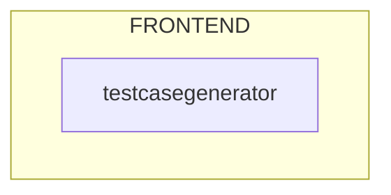
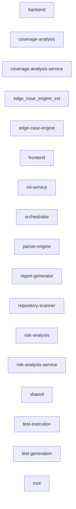
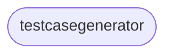

# Architecture Diagrams: EdgeCaseGenerator
> Auto-generated by RepoIntellect — 2026-05-17T11:03:56.156Z

## System Architecture

**Pattern:** component-based
> Component-based frontend architecture

## Dependency Graph

| Metric | Value |
|--------|-------|
| Nodes | 212 |
| Edges | 66 |
| Circular Dependencies | 0 |

## Service Relationships

### Service Details

| Service | Type | Path | Frameworks |
|---------|------|------|------------|
| testcasegenerator | frontend | `frontend` | React, Tailwind CSS |
